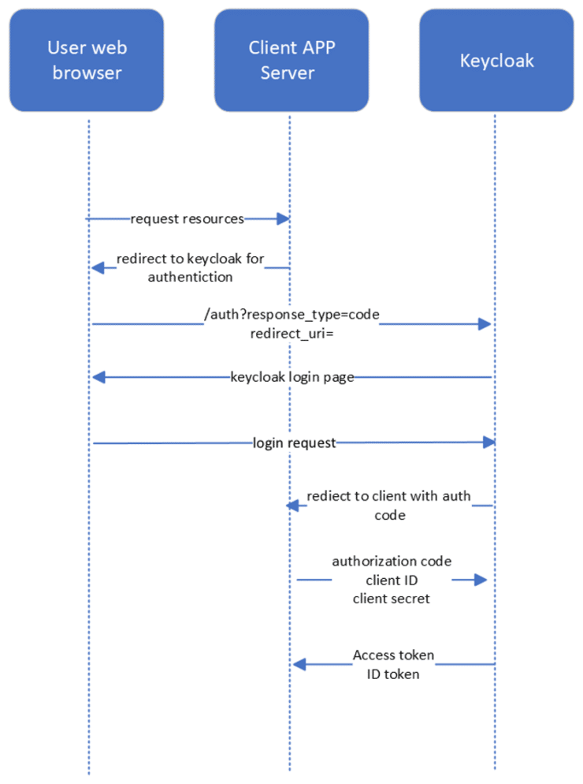

# Keycloak and Authorization Code Flow

## Introduction
This guide focuses on using Keycloak, an open-source Identity and Access Management (IAM) solution, to implement the Authorization Code Flow. This flow is primarily used by web applications to ensure secure authentication and token exchange.

## Keycloak Overview
Keycloak provides robust IAM features, including Single Sign-On (SSO), OAuth2 support, and federated identity management. It streamlines user management and offers a flexible authentication mechanism.

## Authorization Code Flow Explained ([Go to Diagram](#keycloak-flow-diagram))
### Step 1: Authorization Request
The client application directs the user to Keycloak, where the user logs in and grants consent for the requested permissions.

### Step 2: Authorization Code
After the user logs in and approves, Keycloak redirects back to the client with an authorization code.

### Step 3: Token Exchange
The client exchanges the authorization code with Keycloak for an access token, enabling secure access to resources.

### Step 4: Access Token Usage
The access token is then used to authenticate API requests and access protected resources.

## Running Keycloak with Docker
Keycloak can be easily deployed using Docker. For Windows development run this command in WSL terminal:
```
docker run -p 8080:8080 -e KEYCLOAK_ADMIN=admin -e KEYCLOAK_ADMIN_PASSWORD=admin quay.io/keycloak/keycloak:latest start-dev
```

## References
1. [Keycloak Documentation](https://www.keycloak.org/documentation)
2. [Keycloak Article 1](https://embriq.no/en/news/keycloak-and-authorization-code-flow/)
3. [Keycloak Article 2](https://abdulsamet-ileri.medium.com/introduction-to-keycloak-227c3902754a)

## Keycloak Flow Diagram

